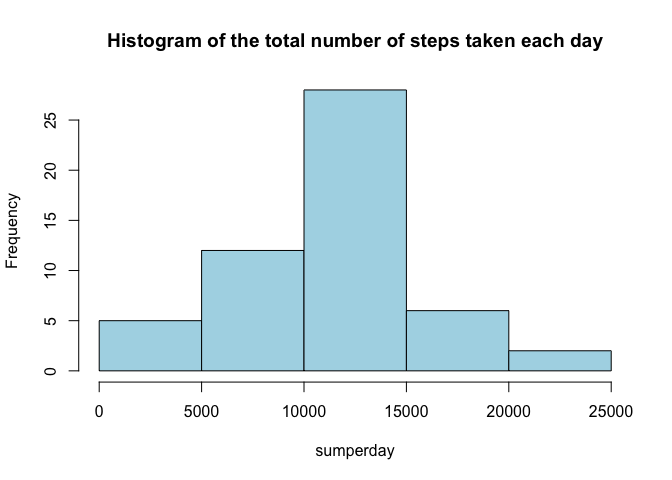
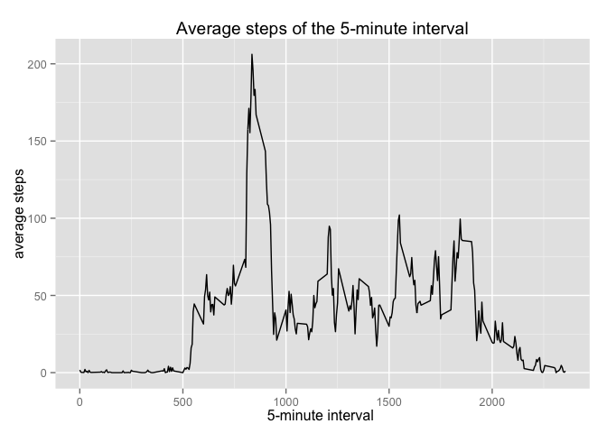
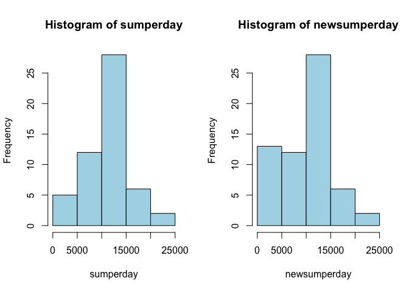
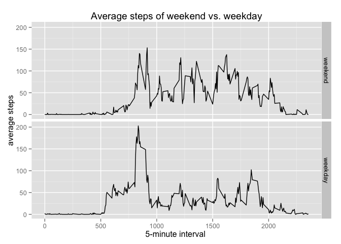

# Reproducible Research: Peer Assessment 1
Luna Gui  
12 October 2014  

## Loading and preprocessing the data


```r
Activity <- read.csv(unzip("activity.zip"))
```

## What is mean total number of steps taken per day?

**1. Make a histogram of the total number of steps taken each day.**

```r
sumperday <- tapply(Activity$steps, Activity$date, sum)
hist(sumperday, col = "lightblue", main = "Histogram of the total number of steps taken each day")
```

 

**2. Calculate and report the mean and median total number of steps taken per day.**

```r
meanperday <- tapply(Activity$steps, Activity$date, mean)
medianperday <- tapply(Activity$steps, Activity$date, median)
## Make a new data cbind with mean and median value
Meanandmedian <- data.frame(cbind(unique(Activity$date), meanperday, medianperday))
library(xtable)
Meanandmedian <- Meanandmedian[,2:3]
print(xtable(Meanandmedian), type = "html")
```

<!-- html table generated in R 3.1.1 by xtable 1.7-4 package -->
<!-- Tue Oct 14 17:03:58 2014 -->
<table border=1>
<tr> <th>  </th> <th> meanperday </th> <th> medianperday </th>  </tr>
  <tr> <td align="right"> 2012-10-01 </td> <td align="right">  </td> <td align="right">  </td> </tr>
  <tr> <td align="right"> 2012-10-02 </td> <td align="right"> 0.44 </td> <td align="right"> 0.00 </td> </tr>
  <tr> <td align="right"> 2012-10-03 </td> <td align="right"> 39.42 </td> <td align="right"> 0.00 </td> </tr>
  <tr> <td align="right"> 2012-10-04 </td> <td align="right"> 42.07 </td> <td align="right"> 0.00 </td> </tr>
  <tr> <td align="right"> 2012-10-05 </td> <td align="right"> 46.16 </td> <td align="right"> 0.00 </td> </tr>
  <tr> <td align="right"> 2012-10-06 </td> <td align="right"> 53.54 </td> <td align="right"> 0.00 </td> </tr>
  <tr> <td align="right"> 2012-10-07 </td> <td align="right"> 38.25 </td> <td align="right"> 0.00 </td> </tr>
  <tr> <td align="right"> 2012-10-08 </td> <td align="right">  </td> <td align="right">  </td> </tr>
  <tr> <td align="right"> 2012-10-09 </td> <td align="right"> 44.48 </td> <td align="right"> 0.00 </td> </tr>
  <tr> <td align="right"> 2012-10-10 </td> <td align="right"> 34.38 </td> <td align="right"> 0.00 </td> </tr>
  <tr> <td align="right"> 2012-10-11 </td> <td align="right"> 35.78 </td> <td align="right"> 0.00 </td> </tr>
  <tr> <td align="right"> 2012-10-12 </td> <td align="right"> 60.35 </td> <td align="right"> 0.00 </td> </tr>
  <tr> <td align="right"> 2012-10-13 </td> <td align="right"> 43.15 </td> <td align="right"> 0.00 </td> </tr>
  <tr> <td align="right"> 2012-10-14 </td> <td align="right"> 52.42 </td> <td align="right"> 0.00 </td> </tr>
  <tr> <td align="right"> 2012-10-15 </td> <td align="right"> 35.20 </td> <td align="right"> 0.00 </td> </tr>
  <tr> <td align="right"> 2012-10-16 </td> <td align="right"> 52.38 </td> <td align="right"> 0.00 </td> </tr>
  <tr> <td align="right"> 2012-10-17 </td> <td align="right"> 46.71 </td> <td align="right"> 0.00 </td> </tr>
  <tr> <td align="right"> 2012-10-18 </td> <td align="right"> 34.92 </td> <td align="right"> 0.00 </td> </tr>
  <tr> <td align="right"> 2012-10-19 </td> <td align="right"> 41.07 </td> <td align="right"> 0.00 </td> </tr>
  <tr> <td align="right"> 2012-10-20 </td> <td align="right"> 36.09 </td> <td align="right"> 0.00 </td> </tr>
  <tr> <td align="right"> 2012-10-21 </td> <td align="right"> 30.63 </td> <td align="right"> 0.00 </td> </tr>
  <tr> <td align="right"> 2012-10-22 </td> <td align="right"> 46.74 </td> <td align="right"> 0.00 </td> </tr>
  <tr> <td align="right"> 2012-10-23 </td> <td align="right"> 30.97 </td> <td align="right"> 0.00 </td> </tr>
  <tr> <td align="right"> 2012-10-24 </td> <td align="right"> 29.01 </td> <td align="right"> 0.00 </td> </tr>
  <tr> <td align="right"> 2012-10-25 </td> <td align="right"> 8.65 </td> <td align="right"> 0.00 </td> </tr>
  <tr> <td align="right"> 2012-10-26 </td> <td align="right"> 23.53 </td> <td align="right"> 0.00 </td> </tr>
  <tr> <td align="right"> 2012-10-27 </td> <td align="right"> 35.14 </td> <td align="right"> 0.00 </td> </tr>
  <tr> <td align="right"> 2012-10-28 </td> <td align="right"> 39.78 </td> <td align="right"> 0.00 </td> </tr>
  <tr> <td align="right"> 2012-10-29 </td> <td align="right"> 17.42 </td> <td align="right"> 0.00 </td> </tr>
  <tr> <td align="right"> 2012-10-30 </td> <td align="right"> 34.09 </td> <td align="right"> 0.00 </td> </tr>
  <tr> <td align="right"> 2012-10-31 </td> <td align="right"> 53.52 </td> <td align="right"> 0.00 </td> </tr>
  <tr> <td align="right"> 2012-11-01 </td> <td align="right">  </td> <td align="right">  </td> </tr>
  <tr> <td align="right"> 2012-11-02 </td> <td align="right"> 36.81 </td> <td align="right"> 0.00 </td> </tr>
  <tr> <td align="right"> 2012-11-03 </td> <td align="right"> 36.70 </td> <td align="right"> 0.00 </td> </tr>
  <tr> <td align="right"> 2012-11-04 </td> <td align="right">  </td> <td align="right">  </td> </tr>
  <tr> <td align="right"> 2012-11-05 </td> <td align="right"> 36.25 </td> <td align="right"> 0.00 </td> </tr>
  <tr> <td align="right"> 2012-11-06 </td> <td align="right"> 28.94 </td> <td align="right"> 0.00 </td> </tr>
  <tr> <td align="right"> 2012-11-07 </td> <td align="right"> 44.73 </td> <td align="right"> 0.00 </td> </tr>
  <tr> <td align="right"> 2012-11-08 </td> <td align="right"> 11.18 </td> <td align="right"> 0.00 </td> </tr>
  <tr> <td align="right"> 2012-11-09 </td> <td align="right">  </td> <td align="right">  </td> </tr>
  <tr> <td align="right"> 2012-11-10 </td> <td align="right">  </td> <td align="right">  </td> </tr>
  <tr> <td align="right"> 2012-11-11 </td> <td align="right"> 43.78 </td> <td align="right"> 0.00 </td> </tr>
  <tr> <td align="right"> 2012-11-12 </td> <td align="right"> 37.38 </td> <td align="right"> 0.00 </td> </tr>
  <tr> <td align="right"> 2012-11-13 </td> <td align="right"> 25.47 </td> <td align="right"> 0.00 </td> </tr>
  <tr> <td align="right"> 2012-11-14 </td> <td align="right">  </td> <td align="right">  </td> </tr>
  <tr> <td align="right"> 2012-11-15 </td> <td align="right"> 0.14 </td> <td align="right"> 0.00 </td> </tr>
  <tr> <td align="right"> 2012-11-16 </td> <td align="right"> 18.89 </td> <td align="right"> 0.00 </td> </tr>
  <tr> <td align="right"> 2012-11-17 </td> <td align="right"> 49.79 </td> <td align="right"> 0.00 </td> </tr>
  <tr> <td align="right"> 2012-11-18 </td> <td align="right"> 52.47 </td> <td align="right"> 0.00 </td> </tr>
  <tr> <td align="right"> 2012-11-19 </td> <td align="right"> 30.70 </td> <td align="right"> 0.00 </td> </tr>
  <tr> <td align="right"> 2012-11-20 </td> <td align="right"> 15.53 </td> <td align="right"> 0.00 </td> </tr>
  <tr> <td align="right"> 2012-11-21 </td> <td align="right"> 44.40 </td> <td align="right"> 0.00 </td> </tr>
  <tr> <td align="right"> 2012-11-22 </td> <td align="right"> 70.93 </td> <td align="right"> 0.00 </td> </tr>
  <tr> <td align="right"> 2012-11-23 </td> <td align="right"> 73.59 </td> <td align="right"> 0.00 </td> </tr>
  <tr> <td align="right"> 2012-11-24 </td> <td align="right"> 50.27 </td> <td align="right"> 0.00 </td> </tr>
  <tr> <td align="right"> 2012-11-25 </td> <td align="right"> 41.09 </td> <td align="right"> 0.00 </td> </tr>
  <tr> <td align="right"> 2012-11-26 </td> <td align="right"> 38.76 </td> <td align="right"> 0.00 </td> </tr>
  <tr> <td align="right"> 2012-11-27 </td> <td align="right"> 47.38 </td> <td align="right"> 0.00 </td> </tr>
  <tr> <td align="right"> 2012-11-28 </td> <td align="right"> 35.36 </td> <td align="right"> 0.00 </td> </tr>
  <tr> <td align="right"> 2012-11-29 </td> <td align="right"> 24.47 </td> <td align="right"> 0.00 </td> </tr>
  <tr> <td align="right"> 2012-11-30 </td> <td align="right">  </td> <td align="right">  </td> </tr>
   </table>

## What is the average daily activity pattern?

**1. Make a time series plot (i.e. type = "l") of the 5-minute interval (x-axis) and the average number of steps taken, averaged across all days (y-axis).**

```r
library(ggplot2)
Temp <- subset(Activity, Activity$date == "2012-10-01")## just for convenience
Activity$interval <- factor(Activity$interval, levels = Temp$interval)
meanofinterval <- tapply(Activity$steps, Activity$interval, mean, na.rm = TRUE)
## make a new data for plot
Average <- data.frame(interval = Temp$interval, meanofinterval)
g <- ggplot(Average, aes(interval, meanofinterval, group= 1))
g + geom_line() + labs(x = "5-minute interval ", y = "average steps", title = "Average steps of the 5-minute interval")
```

 

**2. Which 5-minute interval, on average across all the days in the dataset, contains the maximum number of steps?**


```r
Maxstep <- subset(Average, Average$meanofinterval == max(Average$meanofinterval))
```

On average across all the days in the dataset, **interval 835** contains the maximum number of steps.

## Imputing missing values

**1. Calculate and report the total number of missing values in the dataset (i.e. the total number of rows with NAs)**


```r
missing <- sum(is.na(Activity))
percent <- missing/dim(Activity)[1] * 100
```
There are **2304** row missing values in dataset, about **13.1148%** of all.

**2. Devise a strategy for filling in all of the missing values in the dataset. The strategy does not need to be sophisticated. For example, you could use the mean/median for that day, or the mean for that 5-minute interval, etc.**  
We found that all missing value is in steps. we can replace it by 0, means no stpe on that interval.

**3. Create a new dataset that is equal to the original dataset but with the missing data filled in.**


```r
Newdata <- Activity
Newdata$steps[is.na(Newdata$steps)] <- 0
```

**4. Make a histogram of the total number of steps taken each day and Calculate and report the mean and median total number of steps taken per day. Do these values differ from the estimates from the first part of the assignment? What is the impact of imputing missing data on the estimates of the total daily number of steps?**  

After we fill missing data, total number of steps taken each day looks differ frome the previous plot. **Missing values can have a surprising impact on the way that data is dealt with SUM.** we should watch out that.  


```r
newsumperday <- tapply(Newdata$steps, Newdata$date, sum)
par(mfrow = c(1,2))
hist(sumperday, col = "lightblue")
hist(newsumperday, col = "lightblue")
```

 


But mean and median looks have no difference frome previous table when we trate missing data as 0.  

```r
newmeanperday <- tapply(Newdata$steps, Newdata$date, mean)
newmedianperday <- tapply(Newdata$steps, Newdata$date, median)
NewMeanandmedian <- data.frame(cbind(unique(Newdata$date),meanperday, newmeanperday, medianperday, newmedianperday))
NewMeanandmedian <- NewMeanandmedian[,2:5]
print(xtable(NewMeanandmedian), type = "html")
```

<!-- html table generated in R 3.1.1 by xtable 1.7-4 package -->
<!-- Tue Oct 14 17:04:00 2014 -->
<table border=1>
<tr> <th>  </th> <th> meanperday </th> <th> newmeanperday </th> <th> medianperday </th> <th> newmedianperday </th>  </tr>
  <tr> <td align="right"> 2012-10-01 </td> <td align="right">  </td> <td align="right"> 0.00 </td> <td align="right">  </td> <td align="right"> 0.00 </td> </tr>
  <tr> <td align="right"> 2012-10-02 </td> <td align="right"> 0.44 </td> <td align="right"> 0.44 </td> <td align="right"> 0.00 </td> <td align="right"> 0.00 </td> </tr>
  <tr> <td align="right"> 2012-10-03 </td> <td align="right"> 39.42 </td> <td align="right"> 39.42 </td> <td align="right"> 0.00 </td> <td align="right"> 0.00 </td> </tr>
  <tr> <td align="right"> 2012-10-04 </td> <td align="right"> 42.07 </td> <td align="right"> 42.07 </td> <td align="right"> 0.00 </td> <td align="right"> 0.00 </td> </tr>
  <tr> <td align="right"> 2012-10-05 </td> <td align="right"> 46.16 </td> <td align="right"> 46.16 </td> <td align="right"> 0.00 </td> <td align="right"> 0.00 </td> </tr>
  <tr> <td align="right"> 2012-10-06 </td> <td align="right"> 53.54 </td> <td align="right"> 53.54 </td> <td align="right"> 0.00 </td> <td align="right"> 0.00 </td> </tr>
  <tr> <td align="right"> 2012-10-07 </td> <td align="right"> 38.25 </td> <td align="right"> 38.25 </td> <td align="right"> 0.00 </td> <td align="right"> 0.00 </td> </tr>
  <tr> <td align="right"> 2012-10-08 </td> <td align="right">  </td> <td align="right"> 0.00 </td> <td align="right">  </td> <td align="right"> 0.00 </td> </tr>
  <tr> <td align="right"> 2012-10-09 </td> <td align="right"> 44.48 </td> <td align="right"> 44.48 </td> <td align="right"> 0.00 </td> <td align="right"> 0.00 </td> </tr>
  <tr> <td align="right"> 2012-10-10 </td> <td align="right"> 34.38 </td> <td align="right"> 34.38 </td> <td align="right"> 0.00 </td> <td align="right"> 0.00 </td> </tr>
  <tr> <td align="right"> 2012-10-11 </td> <td align="right"> 35.78 </td> <td align="right"> 35.78 </td> <td align="right"> 0.00 </td> <td align="right"> 0.00 </td> </tr>
  <tr> <td align="right"> 2012-10-12 </td> <td align="right"> 60.35 </td> <td align="right"> 60.35 </td> <td align="right"> 0.00 </td> <td align="right"> 0.00 </td> </tr>
  <tr> <td align="right"> 2012-10-13 </td> <td align="right"> 43.15 </td> <td align="right"> 43.15 </td> <td align="right"> 0.00 </td> <td align="right"> 0.00 </td> </tr>
  <tr> <td align="right"> 2012-10-14 </td> <td align="right"> 52.42 </td> <td align="right"> 52.42 </td> <td align="right"> 0.00 </td> <td align="right"> 0.00 </td> </tr>
  <tr> <td align="right"> 2012-10-15 </td> <td align="right"> 35.20 </td> <td align="right"> 35.20 </td> <td align="right"> 0.00 </td> <td align="right"> 0.00 </td> </tr>
  <tr> <td align="right"> 2012-10-16 </td> <td align="right"> 52.38 </td> <td align="right"> 52.38 </td> <td align="right"> 0.00 </td> <td align="right"> 0.00 </td> </tr>
  <tr> <td align="right"> 2012-10-17 </td> <td align="right"> 46.71 </td> <td align="right"> 46.71 </td> <td align="right"> 0.00 </td> <td align="right"> 0.00 </td> </tr>
  <tr> <td align="right"> 2012-10-18 </td> <td align="right"> 34.92 </td> <td align="right"> 34.92 </td> <td align="right"> 0.00 </td> <td align="right"> 0.00 </td> </tr>
  <tr> <td align="right"> 2012-10-19 </td> <td align="right"> 41.07 </td> <td align="right"> 41.07 </td> <td align="right"> 0.00 </td> <td align="right"> 0.00 </td> </tr>
  <tr> <td align="right"> 2012-10-20 </td> <td align="right"> 36.09 </td> <td align="right"> 36.09 </td> <td align="right"> 0.00 </td> <td align="right"> 0.00 </td> </tr>
  <tr> <td align="right"> 2012-10-21 </td> <td align="right"> 30.63 </td> <td align="right"> 30.63 </td> <td align="right"> 0.00 </td> <td align="right"> 0.00 </td> </tr>
  <tr> <td align="right"> 2012-10-22 </td> <td align="right"> 46.74 </td> <td align="right"> 46.74 </td> <td align="right"> 0.00 </td> <td align="right"> 0.00 </td> </tr>
  <tr> <td align="right"> 2012-10-23 </td> <td align="right"> 30.97 </td> <td align="right"> 30.97 </td> <td align="right"> 0.00 </td> <td align="right"> 0.00 </td> </tr>
  <tr> <td align="right"> 2012-10-24 </td> <td align="right"> 29.01 </td> <td align="right"> 29.01 </td> <td align="right"> 0.00 </td> <td align="right"> 0.00 </td> </tr>
  <tr> <td align="right"> 2012-10-25 </td> <td align="right"> 8.65 </td> <td align="right"> 8.65 </td> <td align="right"> 0.00 </td> <td align="right"> 0.00 </td> </tr>
  <tr> <td align="right"> 2012-10-26 </td> <td align="right"> 23.53 </td> <td align="right"> 23.53 </td> <td align="right"> 0.00 </td> <td align="right"> 0.00 </td> </tr>
  <tr> <td align="right"> 2012-10-27 </td> <td align="right"> 35.14 </td> <td align="right"> 35.14 </td> <td align="right"> 0.00 </td> <td align="right"> 0.00 </td> </tr>
  <tr> <td align="right"> 2012-10-28 </td> <td align="right"> 39.78 </td> <td align="right"> 39.78 </td> <td align="right"> 0.00 </td> <td align="right"> 0.00 </td> </tr>
  <tr> <td align="right"> 2012-10-29 </td> <td align="right"> 17.42 </td> <td align="right"> 17.42 </td> <td align="right"> 0.00 </td> <td align="right"> 0.00 </td> </tr>
  <tr> <td align="right"> 2012-10-30 </td> <td align="right"> 34.09 </td> <td align="right"> 34.09 </td> <td align="right"> 0.00 </td> <td align="right"> 0.00 </td> </tr>
  <tr> <td align="right"> 2012-10-31 </td> <td align="right"> 53.52 </td> <td align="right"> 53.52 </td> <td align="right"> 0.00 </td> <td align="right"> 0.00 </td> </tr>
  <tr> <td align="right"> 2012-11-01 </td> <td align="right">  </td> <td align="right"> 0.00 </td> <td align="right">  </td> <td align="right"> 0.00 </td> </tr>
  <tr> <td align="right"> 2012-11-02 </td> <td align="right"> 36.81 </td> <td align="right"> 36.81 </td> <td align="right"> 0.00 </td> <td align="right"> 0.00 </td> </tr>
  <tr> <td align="right"> 2012-11-03 </td> <td align="right"> 36.70 </td> <td align="right"> 36.70 </td> <td align="right"> 0.00 </td> <td align="right"> 0.00 </td> </tr>
  <tr> <td align="right"> 2012-11-04 </td> <td align="right">  </td> <td align="right"> 0.00 </td> <td align="right">  </td> <td align="right"> 0.00 </td> </tr>
  <tr> <td align="right"> 2012-11-05 </td> <td align="right"> 36.25 </td> <td align="right"> 36.25 </td> <td align="right"> 0.00 </td> <td align="right"> 0.00 </td> </tr>
  <tr> <td align="right"> 2012-11-06 </td> <td align="right"> 28.94 </td> <td align="right"> 28.94 </td> <td align="right"> 0.00 </td> <td align="right"> 0.00 </td> </tr>
  <tr> <td align="right"> 2012-11-07 </td> <td align="right"> 44.73 </td> <td align="right"> 44.73 </td> <td align="right"> 0.00 </td> <td align="right"> 0.00 </td> </tr>
  <tr> <td align="right"> 2012-11-08 </td> <td align="right"> 11.18 </td> <td align="right"> 11.18 </td> <td align="right"> 0.00 </td> <td align="right"> 0.00 </td> </tr>
  <tr> <td align="right"> 2012-11-09 </td> <td align="right">  </td> <td align="right"> 0.00 </td> <td align="right">  </td> <td align="right"> 0.00 </td> </tr>
  <tr> <td align="right"> 2012-11-10 </td> <td align="right">  </td> <td align="right"> 0.00 </td> <td align="right">  </td> <td align="right"> 0.00 </td> </tr>
  <tr> <td align="right"> 2012-11-11 </td> <td align="right"> 43.78 </td> <td align="right"> 43.78 </td> <td align="right"> 0.00 </td> <td align="right"> 0.00 </td> </tr>
  <tr> <td align="right"> 2012-11-12 </td> <td align="right"> 37.38 </td> <td align="right"> 37.38 </td> <td align="right"> 0.00 </td> <td align="right"> 0.00 </td> </tr>
  <tr> <td align="right"> 2012-11-13 </td> <td align="right"> 25.47 </td> <td align="right"> 25.47 </td> <td align="right"> 0.00 </td> <td align="right"> 0.00 </td> </tr>
  <tr> <td align="right"> 2012-11-14 </td> <td align="right">  </td> <td align="right"> 0.00 </td> <td align="right">  </td> <td align="right"> 0.00 </td> </tr>
  <tr> <td align="right"> 2012-11-15 </td> <td align="right"> 0.14 </td> <td align="right"> 0.14 </td> <td align="right"> 0.00 </td> <td align="right"> 0.00 </td> </tr>
  <tr> <td align="right"> 2012-11-16 </td> <td align="right"> 18.89 </td> <td align="right"> 18.89 </td> <td align="right"> 0.00 </td> <td align="right"> 0.00 </td> </tr>
  <tr> <td align="right"> 2012-11-17 </td> <td align="right"> 49.79 </td> <td align="right"> 49.79 </td> <td align="right"> 0.00 </td> <td align="right"> 0.00 </td> </tr>
  <tr> <td align="right"> 2012-11-18 </td> <td align="right"> 52.47 </td> <td align="right"> 52.47 </td> <td align="right"> 0.00 </td> <td align="right"> 0.00 </td> </tr>
  <tr> <td align="right"> 2012-11-19 </td> <td align="right"> 30.70 </td> <td align="right"> 30.70 </td> <td align="right"> 0.00 </td> <td align="right"> 0.00 </td> </tr>
  <tr> <td align="right"> 2012-11-20 </td> <td align="right"> 15.53 </td> <td align="right"> 15.53 </td> <td align="right"> 0.00 </td> <td align="right"> 0.00 </td> </tr>
  <tr> <td align="right"> 2012-11-21 </td> <td align="right"> 44.40 </td> <td align="right"> 44.40 </td> <td align="right"> 0.00 </td> <td align="right"> 0.00 </td> </tr>
  <tr> <td align="right"> 2012-11-22 </td> <td align="right"> 70.93 </td> <td align="right"> 70.93 </td> <td align="right"> 0.00 </td> <td align="right"> 0.00 </td> </tr>
  <tr> <td align="right"> 2012-11-23 </td> <td align="right"> 73.59 </td> <td align="right"> 73.59 </td> <td align="right"> 0.00 </td> <td align="right"> 0.00 </td> </tr>
  <tr> <td align="right"> 2012-11-24 </td> <td align="right"> 50.27 </td> <td align="right"> 50.27 </td> <td align="right"> 0.00 </td> <td align="right"> 0.00 </td> </tr>
  <tr> <td align="right"> 2012-11-25 </td> <td align="right"> 41.09 </td> <td align="right"> 41.09 </td> <td align="right"> 0.00 </td> <td align="right"> 0.00 </td> </tr>
  <tr> <td align="right"> 2012-11-26 </td> <td align="right"> 38.76 </td> <td align="right"> 38.76 </td> <td align="right"> 0.00 </td> <td align="right"> 0.00 </td> </tr>
  <tr> <td align="right"> 2012-11-27 </td> <td align="right"> 47.38 </td> <td align="right"> 47.38 </td> <td align="right"> 0.00 </td> <td align="right"> 0.00 </td> </tr>
  <tr> <td align="right"> 2012-11-28 </td> <td align="right"> 35.36 </td> <td align="right"> 35.36 </td> <td align="right"> 0.00 </td> <td align="right"> 0.00 </td> </tr>
  <tr> <td align="right"> 2012-11-29 </td> <td align="right"> 24.47 </td> <td align="right"> 24.47 </td> <td align="right"> 0.00 </td> <td align="right"> 0.00 </td> </tr>
  <tr> <td align="right"> 2012-11-30 </td> <td align="right">  </td> <td align="right"> 0.00 </td> <td align="right">  </td> <td align="right"> 0.00 </td> </tr>
   </table>

## Are there differences in activity patterns between weekdays and weekends?


```r
library(lubridate)
weekday <- wday(ymd(Newdata$date))
wday <- ifelse(weekday==7 | weekday ==1, "weekend", "weekday")
Newdata <- data.frame(Newdata, wday)
## Split dataset and calculate the mean based on wday
Weekendset <- subset(Newdata, Newdata$wday == "weekend")
Weekdayset <- subset(Newdata, Newdata$wday == "weekday")
meanofweekend <- tapply(Weekendset$steps, Weekendset$interval, mean)
meanofweekday <- tapply(Weekdayset$steps, Weekdayset$interval, mean)
## Make a new data for plot
Averageofweekstep1 <- data.frame(interval = Temp$interval, mean = meanofweekend,wday = "weekend")
Averageofweekstep2 <- data.frame(interval = Temp$interval, mean = meanofweekday,wday = "weekday")
Averageofweekstep <- rbind(Averageofweekstep1,Averageofweekstep2)
g2 <- ggplot(Averageofweekstep, aes(interval, mean))
g2 + geom_line() + facet_grid(wday~.)+labs(x = "5-minute interval ", y = "average steps", title = "Average steps of weekend vs. weekday")
```

 
